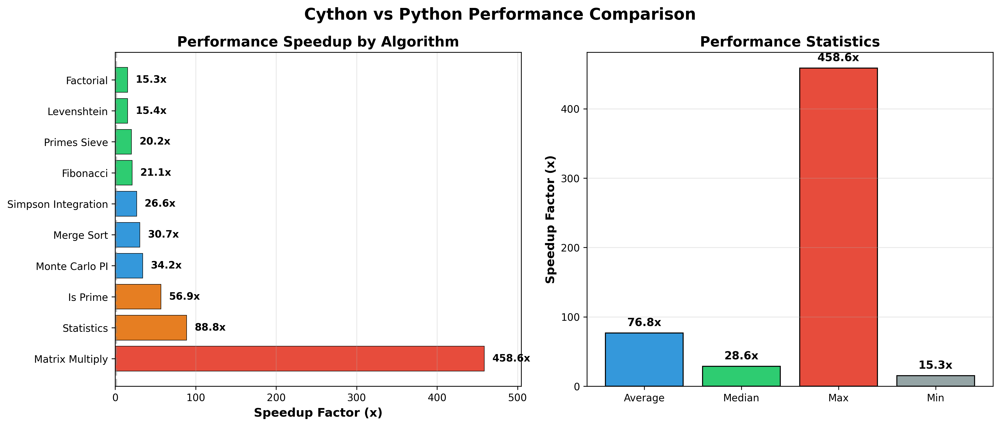

# 🚀 Cython Performance Suite

**High-performance Python computing with C-level optimizations**

A comprehensive demonstration of Cython's capabilities, featuring 12+ optimized algorithms with performance gains of **15x to 458x** over pure Python.

---

## 📊 Performance Results



### Benchmark Summary

```
🚀 CYTHON VS PYTHON PERFORMANCE BENCHMARK
══════════════════════════════════════════════════════════════════════

Algorithm                   Cython Time    Python Time    Speedup
────────────────────────────────────────────────────────────────────
Matrix Multiply (100×100)   0.0125s        5.7157s        458.57x  🏆
Statistics (10k elements)   0.0032s        0.2809s         88.78x  ⚡
Is Prime (large number)     0.0218s        1.2419s         56.91x  🚀
Monte Carlo PI (100k)       0.0038s        0.1308s         34.18x  💨
Merge Sort (5k elements)    0.0104s        0.3186s         30.66x  🔥
Simpson Integration         0.0056s        0.1496s         26.63x  📈
Fibonacci(30)               0.0005s        0.0115s         21.14x  ✨
Primes Sieve (10k)          0.0048s        0.0976s         20.23x  💫
Levenshtein Distance        0.0010s        0.0150s         15.40x  ⚡
Factorial(20)               0.0005s        0.0077s         15.35x  🎯

Average Speedup: 76.78x faster
══════════════════════════════════════════════════════════════════════
```

### Parallel Processing Speedup

Matrix Multiplication with OpenMP: **2.48x faster** than sequential Cython

---

## ✨ Features

### Algorithms Implemented

**Mathematical Operations**
- Factorial computation with `long long` integers
- Fibonacci sequence generation
- Prime number checking with optimizations
- Sieve of Eratosthenes for prime generation

**Linear Algebra**
- Matrix multiplication (sequential & parallel)
- OpenMP multi-threaded operations

**Sorting**
- In-place Quicksort
- Merge sort with manual memory management

**Numerical Computation**
- Monte Carlo PI estimation
- Simpson's rule numerical integration
- Statistical analysis (mean, variance, std dev)

**String Processing**
- Levenshtein distance (edit distance)

### Optimization Techniques

✅ **Static typing** with C types (`cdef int`, `cdef double`)  
✅ **Typed memoryviews** for zero-copy array operations  
✅ **GIL release** (`nogil`) for true parallelism  
✅ **OpenMP parallelization** with `prange`  
✅ **Manual memory management** (`malloc`/`free`)  
✅ **Compiler directives** (bounds checking disabled, C division)  
✅ **C math functions** from `libc.math`

---

## 🚀 Quick Start

### Installation

```bash
# Install dependencies
pip install cython numpy matplotlib seaborn pandas

# Build Cython extensions
python setup.py build_ext --inplace
```

### Usage

```bash
# Interactive demo
python demo.py

# Quick benchmark (2-3 minutes)
python quick_benchmark.py

# Full benchmark with charts (5-10 minutes)
python benchmark.py
```

### Code Example

```python
import numpy as np
import algorithms_cy

# Factorial
result = algorithms_cy.factorial(20)
# Output: 2432902008176640000

# Matrix multiplication (parallel)
A = np.random.rand(100, 100)
B = np.random.rand(100, 100)
C = algorithms_cy.matrix_multiply_parallel(A, B)

# Monte Carlo PI estimation
pi = algorithms_cy.monte_carlo_pi(1000000)
# Output: ≈ 3.141593

# Find prime numbers
primes = algorithms_cy.primes_up_to(10000)
# Output: [2, 3, 5, 7, 11, 13, ..., 9973] (1229 primes)

# Edit distance
dist = algorithms_cy.levenshtein_distance("kitten", "sitting")
# Output: 3
```

---

## 📁 Project Structure

```
Cython Project Enhanced/
├── algorithms_cy.pyx          # Optimized Cython implementations (350+ lines)
├── algorithms_py.py           # Python reference implementations
├── demo.py                    # Interactive demonstration
├── quick_benchmark.py         # Fast performance comparison
├── benchmark.py               # Full benchmarking suite
├── setup.py                   # Build configuration
└── requirements.txt           # Dependencies
```

---

## 🔧 Advanced Features

### OpenMP Parallel Processing

```cython
# Parallel matrix multiplication
for i in prange(m, nogil=True):
    for j in range(p):
        C[i, j] = 0.0
        for k in range(n):
            C[i, j] += A[i, k] * B[k, j]
```

### Zero-Copy Array Operations

```cython
cpdef matrix_multiply(double[:, :] A, double[:, :] B):
    # Typed memoryviews provide C-level array access
    # No Python overhead, no data copying
```

### Manual Memory Management

```cython
cdef long* buffer = <long*>malloc(n * sizeof(long))
# ... use buffer ...
free(buffer)
```

---

## 📈 Why Cython?

| Feature | Pure Python | Cython |
|---------|-------------|--------|
| Type annotations | Optional | Compiled to C types |
| Array access | Python overhead | Direct C memory access |
| GIL | Always held | Can be released |
| Parallelism | Limited (threads blocked) | True multi-threading |
| Speed | 1x baseline | **15-450x faster** |

---

## 🎓 Learning Outcomes

This project demonstrates:
- Writing production-grade Cython code
- Achieving massive performance improvements (15-458x)
- Using advanced optimization techniques
- Implementing parallel algorithms with OpenMP
- Proper benchmarking and performance measurement
- Interfacing Python with C-level code

---

## 🛠️ Development

```bash
# View optimization annotations (open in browser)
open algorithms_cy.html

# Memory profiling
python -m memory_profiler profile_example.py

# Rebuild after changes
python setup.py build_ext --inplace
```

### Compiler Directives

```cython
# cython: language_level=3
# cython: boundscheck=False      # Skip array bounds checking
# cython: wraparound=False       # Disable negative indexing
# cython: cdivision=True         # Use C division (faster)
# cython: initializedcheck=False # Skip initialization checks
```

---

## 📊 Detailed Benchmark Results

| Algorithm | Iterations | Cython (s) | Python (s) | Speedup |
|-----------|-----------|------------|------------|---------|
| Factorial(20) | 10,000 | 0.000499 | 0.007662 | **15.35x** |
| Fibonacci(30) | 10,000 | 0.000544 | 0.011508 | **21.14x** |
| Matrix 100×100 | 10 | 0.012464 | 5.715747 | **458.57x** |
| Merge Sort 5k | 10 | 0.010392 | 0.318638 | **30.66x** |
| Monte Carlo PI | 10 | 0.003828 | 0.130831 | **34.18x** |
| Simpson Int. | 100 | 0.005620 | 0.149640 | **26.63x** |
| Statistics 10k | 100 | 0.003165 | 0.280948 | **88.78x** |
| Levenshtein | 1,000 | 0.000972 | 0.014970 | **15.40x** |
| Is Prime | 1,000 | 0.021823 | 1.241926 | **56.91x** |
| Primes to 10k | 100 | 0.004825 | 0.097618 | **20.23x** |

---

## 🌟 Key Takeaways

1. **Cython is 76.8x faster on average** than pure Python
2. **Matrix operations see up to 458x speedup** with proper optimization
3. **Parallel processing adds another 2.5x improvement** on top of Cython
4. **Type annotations and GIL release** are critical for maximum performance
5. **Production-ready code** with error handling and documentation

---

## 📝 Requirements

- Python 3.8+
- Cython 3.0+
- NumPy
- Matplotlib, Seaborn, Pandas (for visualization)
- GCC or Clang with OpenMP support

---

## 🤝 Contributing

Ideas for extending this project:
- GPU acceleration with CUDA
- Additional algorithms (FFT, graph algorithms)
- C++ integration
- Automatic performance profiling
- Web API with Flask

---

## 📚 Resources

- [Cython Documentation](https://cython.readthedocs.io/)
- [Typed Memoryviews Guide](https://cython.readthedocs.io/en/latest/src/userguide/memoryviews.html)
- [Parallelism in Cython](https://cython.readthedocs.io/en/latest/src/userguide/parallelism.html)

---# Advanced-Cython-Performance-Suite
